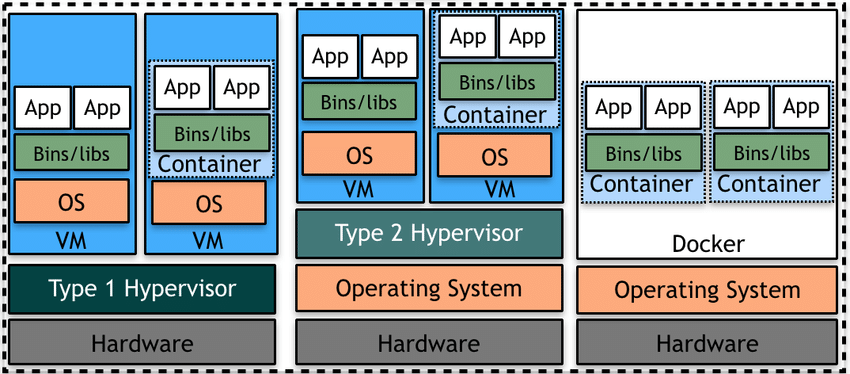

# The Red Guild's devcontainer exploration (article branch)
This is a branch explicitly created as a demonstration, to use our devcontainer
please refer to our most updated branch, which is the **main** branch.
Article : [Where do you run your code?](https://blog.theredguild.org/where-do-you-run-your-code/)

# Appendix to the article
## 1. Importance of Sandboxing
- **Principle of Least Privilege:** Sandboxing adheres to the principle of least privilege, granting applications only the permissions and resources they require to function, thus reducing the potential impact of a security breach.
- **Malware Containment:** Sandboxing plays a crucial role in containing malware infections. If a sandboxed application is compromised, the malware is restricted within the sandbox, preventing it from spreading to other parts of the system.
- **Secure Execution Environment:** Sandboxes provide a controlled environment for executing untrusted code, such as third-party plugins, extensions, or user-submitted scripts, without exposing the underlying system to potential risks.
- **Compliance and Regulations:** In industries with strict security and compliance requirements, such as finance or healthcare, sandboxing helps ensure that sensitive data remains isolated and protected from unauthorized access or leakage.
- **Forensic Analysis:** Sandboxes are valuable tools for security researchers and analysts to study malware behavior and vulnerabilities safely. By executing malicious code within a sandbox, analysts can observe its actions and develop appropriate countermeasures without compromising real systems.

## 2. Containers

Containers are like mini-environments for your apps, keeping them isolated from each other and the host system. They use **namespaces** to ensure that processes, files, and network settings are separate, while **cgroups** manage resource limits. Security features like **seccomp, SELinux,** and **AppArmor** add extra protection. Because containers package everything an app needs, they ensure consistent behavior across different environments. This makes containers reliable, secure, and portable, much like a sandbox for your applications.

### 2.1 Containers vs Virtual Machines

Containers and virtual machines (VMs) are both **virtualization technologies** used to isolate applications and their dependencies, but they differ in their approach and level of abstraction.

#### **Virtual Machines**:

- VMs emulate an entire computer system, including the hardware.
- Each VM runs its own full-fledged operating system (OS) on top of a hypervisor.
- VMs provide strong isolation but are resource-intensive and have slower startup times.

#### **Containers**:

- Containers share the host system's kernel and isolate the application processes.
- Each container packages the application and its dependencies, libraries, and configuration files.
- Containers are lightweight, have faster startup times, and consume fewer resources compared to VMs.

Containers offer a more efficient and portable way to package and deploy applications consistently across different environments.

**Container-based Virtualization vs. Traditional Virtualization.** Source: [Elasticity in cloud computing.](https://www.researchgate.net/figure/Container-based-Virtualization-vs-Traditional-Virtualization_fig4_317297877)

Let's further compare containers and virtualization:

- **Resource Utilization**:
    - Containers share the host system's kernel and resources, resulting in lower overhead and better resource utilization compared to VMs.
    - VMs require separate operating systems and resources for each instance, leading to higher resource consumption.
- **Scalability**:
    - Containers are lightweight and can be quickly spawned or terminated based on demand, making them highly scalable.
    - VMs have a higher startup time and resource footprint, limiting their scalability compared to containers.
- **Networking**:
    - Containers can share the same network namespace, allowing easy communication between containers on the same host.
    - VMs have their own isolated network stack, requiring additional configuration for communication between VMs.
- **Use Cases**:
    - Containers are well-suited for microservices architectures, where applications are broken down into smaller, independently deployable services.
    - VMs are commonly used for running multiple operating systems, legacy applications, or scenarios requiring stronger isolation between workloads.

Today's virtualization methods have evolved in a way that they do not exactly match the defined criteria above. One key example of this is the concept of Memory Ballooing in which the host system can reclaim memory from virtual machines (VM) by telling them to give back part of their memory to the host system. Another one is micro-vms.

### 2.2 Docker First Steps

**Docker** is the most popular platform (or at least from my observable universe) for creating, deploying, and running containers. You could do this with Kubernetes as well, so it shouldn’t be much more difficult to pivot once you’ve interiorized the core principles.

#### Docker terms

1. **Image**: A Docker image is a lightweight, standalone, and executable software package that includes everything needed to run a piece of software, including the code, a runtime, libraries, environment variables, and configuration files. Images are built from a series of layers that are defined in a Dockerfile. Each layer represents an instruction in the Dockerfile. Images are immutable, meaning once they are created, they do not change.
2. **Container**: A container is a runnable instance of an image. When you start an image, Docker creates a container from that image. Containers isolate software from its environment and ensure that it works uniformly despite differences for instance between development and staging. Containers are ephemeral, meaning they can be started, stopped, moved, and deleted. Each container has its own filesystem, provided by the image, and its own isolated system resources (CPU, memory, I/O, network, etc.). If you do not save the state of your container, all changes will be lost once it is terminated.
3. **Volume**: Volumes are the preferred mechanism for persisting data generated by and used by Docker containers. Docker volumes are completely managed by Docker and exist as normal directories or files on the host machine’s filesystem. They are designed to persist data, independent of the container's life cycle. This means you can stop the container, destroy it, and even recreate it from another image, and your data will remain untouched in the volume. Volumes can be more safely shared among multiple containers and can have various configurations and drivers supporting them, allowing for data storage to be managed more flexibly or optimized for specific needs.

To summarize:

- An **image** is a static snapshot of the environment and application, used to create containers.
- A **container** is an instance of an image that runs the actual application.
- A **volume** is used to persist data outside of the lifecycle of a single container, helping manage data across container instances and updates.

So, to get started with **Docker** you should:

1. Install Docker on your system by following the official documentation for your operating system:`docker` and `docker-buildx` (the latter is not strictly necessary, but as a minimum it helps to build faster).
2. Verify the installation by running the following command in your terminal:
    
    `docker version`
    
3. Run a simple "Hello, World!" container to ensure Docker is working correctly:
    
    `docker run hello-world`
    
4. Explore Docker commands to manage images and containers:
    - `docker pull`: Download an image from a registry
    - `docker run`: Create and start a new container
    - `docker ps`: List running containers
    - `docker stop`: Stop a running container
    - `docker rm`: Remove a stopped container

If you’d like to further explore Docker, here are a few hints to where you can start of:

1. Learn about [Dockerfiles](https://docs.docker.com/get-started/02_our_app/), which are text files containing [instructions to build Docker images](https://docker-curriculum.com/):
    - Understand the basic structure of a Dockerfile (e.g., `FROM`, `RUN`, `COPY`, `CMD`).
    - Create a simple Dockerfile for your application.
    - Build an image from the Dockerfile using `docker build`.
2. Explore Docker Compose, a tool for defining and running multi-container applications:
    - Learn how to create a `docker-compose.yml` file to define services, networks, and volumes.
    - Use Docker Compose to start and manage multiple containers as a single application stack.
3. Understand Docker networking concepts:
    - Learn about different network drivers (e.g., bridge, host, overlay).
    - Configure networking between containers using Docker networks.
4. Familiarize yourself with Docker volumes and data persistence:
    - Understand how to mount host directories or create named volumes for data persistence.
    - Use volumes to share data between containers or persist data beyond the lifecycle of a container.

## 3. DevContainer

A DevContainer, short for "development container," is a preconfigured development environment packaged as a Docker container (could be k8s as we said before). DevContainers provide a consistent, isolated, and reproducible environment for developers to work on a project, regardless of their local machine setup (more of the same stuff as you can see).

The features of DevContainers aren’t different from the ones of a container, except for the fact that they can be integrated with IDEs such as Visual Studio Code (IntelliJ, Pycharm, and possibly more that I don’t know of as well). This makes it possible to define even the extensions that you want to use and where you want to run them (locally or remotely).

In short, DevContainers streamline the setup process, enhance collaboration, and ensure a consistent development experience for all team members!

Let's explore more aspects of them:

1. **Customization**: DevContainers can be customized to include specific tools, extensions, and configurations tailored to your project's needs. You can define your DevContainer configuration in a `devcontainer.json` file.
2. **Version Control**: configurations can be version-controlled alongside your project's codebase, ensuring that everyone working on the project has access to the same development environment.
3. **Collaboration**: facilitate collaboration by providing a standardized environment for team members to work on the same project. This eliminates discrepancies caused by different local machine setups and ensures consistency across the team.
4. **Onboarding**: simplify the onboarding process for new team members. Instead of spending time setting up their local development environment, new team members can quickly start contributing by using the project's DevContainer.
5. **Remote Development**: enable remote development scenarios, allowing developers to work on a project from any machine with Docker and VS Code installed. This is particularly useful for working on resource-intensive projects or when using low-powered devices like Chromebooks.

#### Useful links

- [devcontainers extension](https://marketplace.visualstudio.com/items?itemName=ms-vscode-remote.remote-containers)
- [schema documentation](https://containers.dev/implementors/json_reference/) and [schema](https://github.com/devcontainers/spec/blob/main/schemas/devContainer.base.schema.json).
- Helpful devcontainer images:
    - [List of devcontainer images](https://github.com/devcontainers/images/tree/main/src)
    - [Docker’s official devcontainer images](https://hub.docker.com/_/microsoft-vscode-devcontainers) / [search](https://hub.docker.com/search?q=devcontainer)
- [Features](https://containers.dev/features)
- Templates:
    - [Devcontainer templates](https://containers.dev/templates)
    - [Template starters](https://github.com/devcontainers/template-starter)
- [Guide for VisualStudio remote development](https://code.visualstudio.com/docs/remote/remote-overview)
- [How to containerize an application](https://docs.docker.com/get-started/02_our_app/)
- Coder - [coder.com](http://coder.com)
- DevPod - [devpod.sh](http://devpod.sh)
- [CodeSpaces](https://github.com/codespaces)

